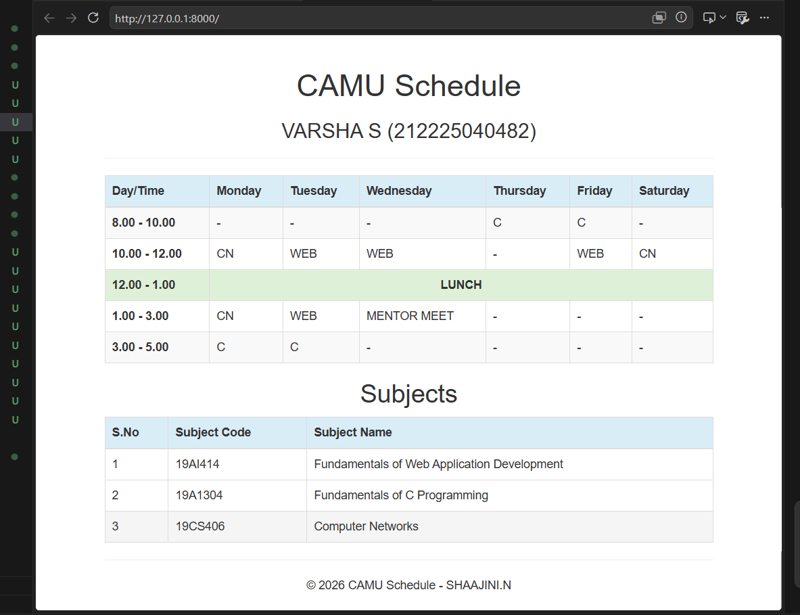

# Ex08 CAMU Schedule using Bootstrap
## Date:

## AIM:
To design a responsive and visually appealing CAMU Schedule using Bootstrap.

## DESIGN STEPS:
### Step 1:
Clone the repository from GitHub.

### Step 2:
Create Django Admin project.

### Step 3:
Create a New App under the Django Admin project.

### Step 4:
Add the Bootstrap CDN link inside the <head> section.

### Step 5:
Insert a table element with Bootstrap table classes.

### Step 6:
Construct the complete table.

### Step 7:
Add a header/footer displaying copyright information.

### Step 8:
Publish the website in the LocalHost.

## PROGRAM :
```
<!DOCTYPE html>
<html>
<head>
    <title>CAMU Schedule</title>

    <link rel="stylesheet"
    href="https://maxcdn.bootstrapcdn.com/bootstrap/3.4.1/css/bootstrap.min.css">

    <script src="https://ajax.googleapis.com/ajax/libs/jquery/3.7.1/jquery.min.js"></script>

    <script src="https://maxcdn.bootstrapcdn.com/bootstrap/3.4.1/js/bootstrap.min.js"></script>
</head>

<body>

<div class="container">

    <div class="page-header text-center">
        <h1>CAMU Schedule</h1>
        <h3>VARSHA S (212225040482)</h3>
    </div>

    <table class="table table-bordered table-striped table-hover">
        <thead>
            <tr class="info">
                <th>Day/Time</th>
                <th>Monday</th>
                <th>Tuesday</th>
                <th>Wednesday</th>
                <th>Thursday</th>
                <th>Friday</th>
                <th>Saturday</th>
            </tr>
        </thead>

        <tbody>
            <tr>
                <td><b>8.00 - 10.00</b></td>
                <td>-</td>
                <td>-</td>
                <td>-</td>
                <td>C</td>
                <td>C</td>
                <td>-</td>
            </tr>

            <tr>
                <td><b>10.00 - 12.00</b></td>
                <td>CN</td>
                <td>WEB</td>
                <td>WEB</td>
                <td>-</td>
                <td>WEB</td>
                <td>CN</td>
            </tr>

            <tr class="success">
                <td><b>12.00 - 1.00</b></td>
                <td colspan="6" class="text-center">
                    <strong>LUNCH</strong>
                </td>
            </tr>

            <tr>
                <td><b>1.00 - 3.00</b></td>
                <td>CN</td>
                <td>WEB</td>
                <td>MENTOR MEET</td>
                <td>-</td>
                <td>-</td>
                <td>-</td>
            </tr>

            <tr>
                <td><b>3.00 - 5.00</b></td>
                <td>C</td>
                <td>C</td>
                <td>-</td>
                <td>-</td>
                <td>-</td>
                <td>-</td>
            </tr>
        </tbody>
    </table>

    <h2 class="text-center">Subjects</h2>

    <table class="table table-bordered table-hover">
        <thead>
            <tr class="info">
                <th>S.No</th>
                <th>Subject Code</th>
                <th>Subject Name</th>
            </tr>
        </thead>

        <tbody>
            <tr>
                <td>1</td>
                <td>19AI414</td>
                <td>Fundamentals of Web Application Development</td>
            </tr>

            <tr>
                <td>2</td>
                <td>19A1304</td>
                <td>Fundamentals of C Programming</td>
            </tr>

            <tr>
                <td>3</td>
                <td>19CS406</td>
                <td>Computer Networks</td>
            </tr>
        </tbody>
    </table>

    <footer class="text-center">
        <hr>
        <p>&copy; 2026 CAMU Schedule - SHAAJINI.N</p>
    </footer>

</div>

</body>
</html>


```


## OUTPUT:





## RESULT:
A responsive and visually appealing CAMU Schedule web page using Bootstrap is designed successfully.
